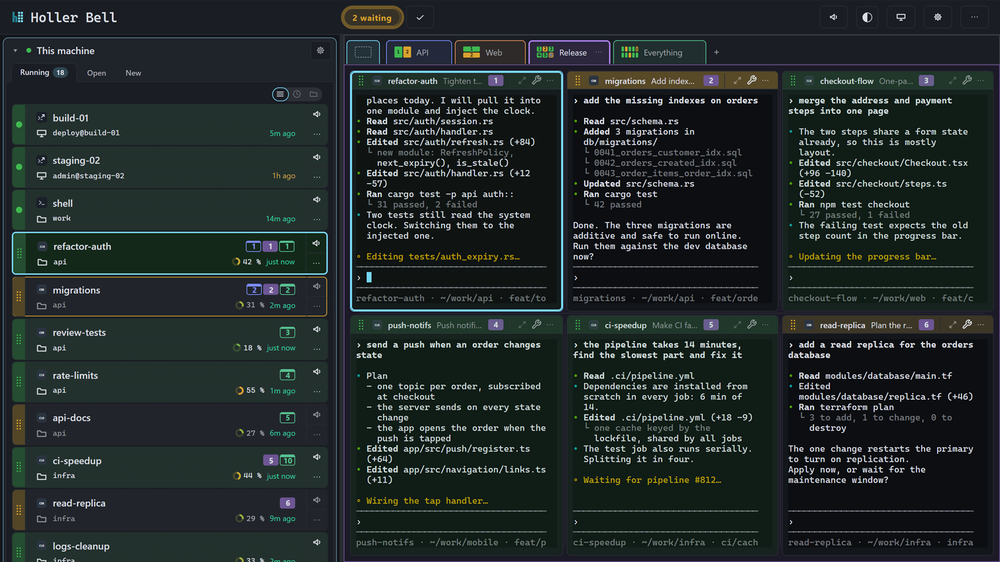
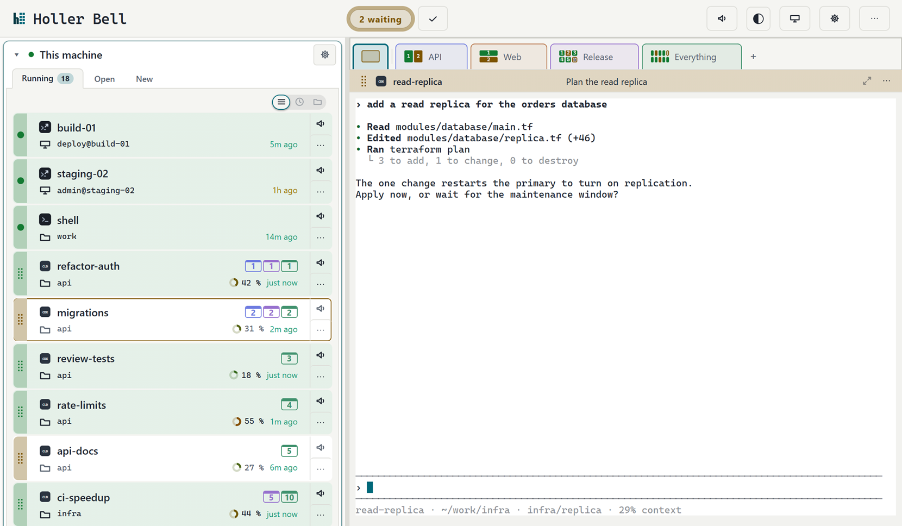
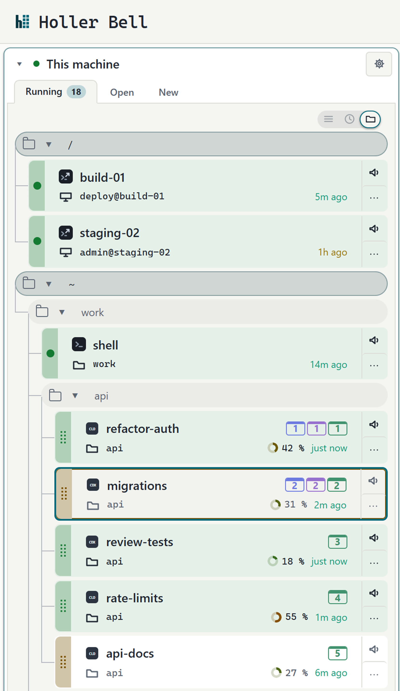
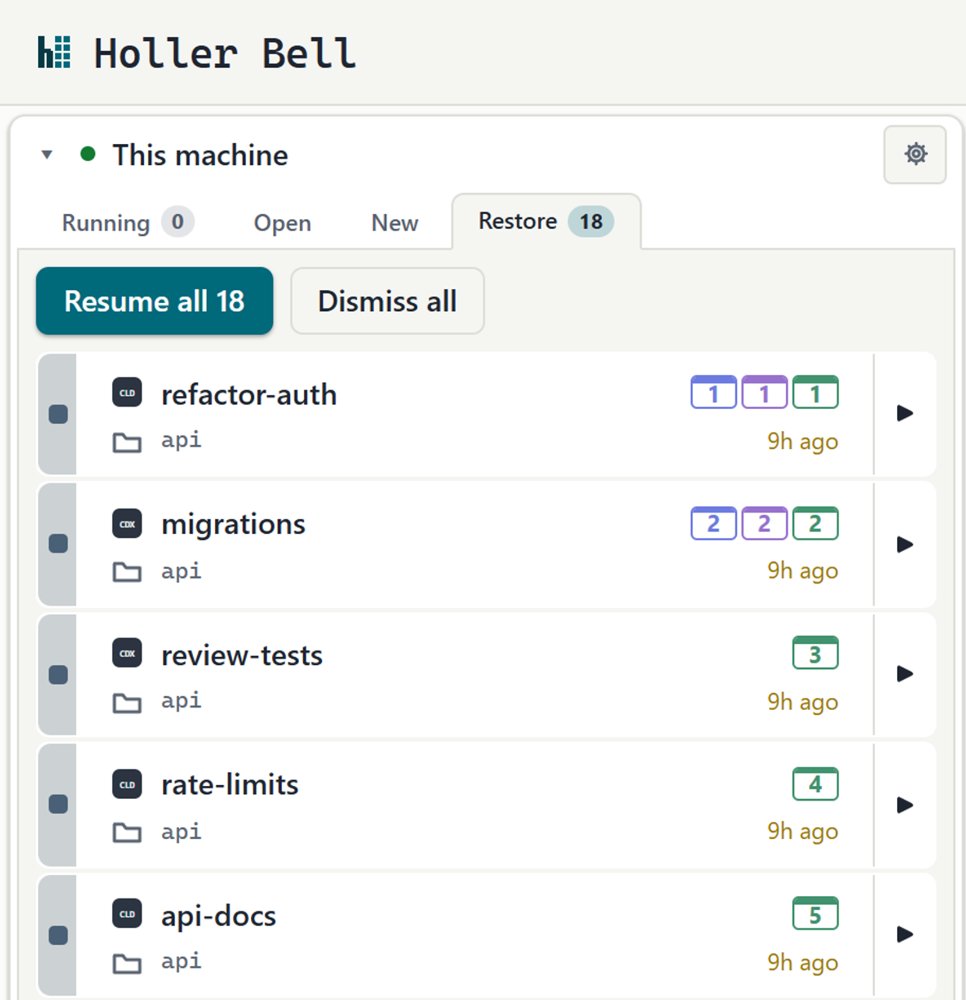
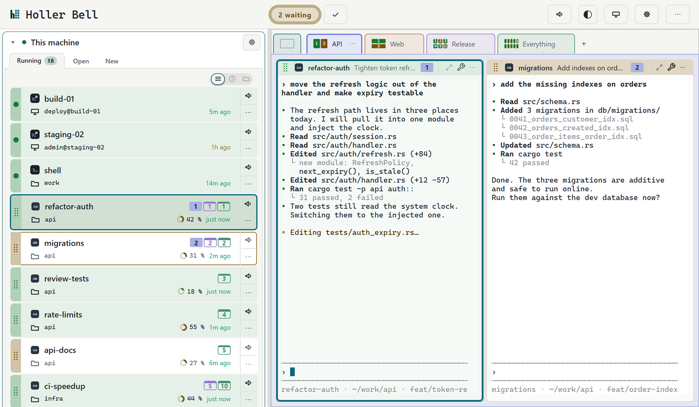
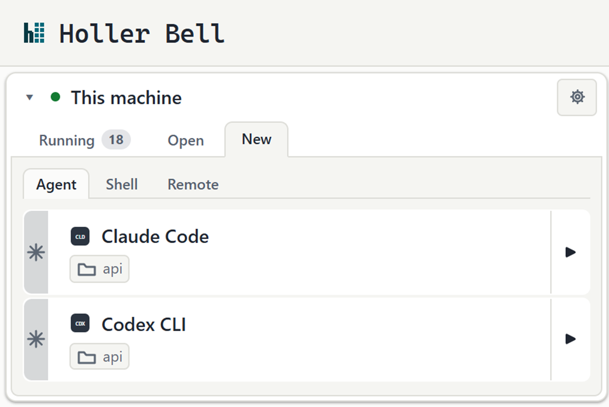

  <picture>
    <source media="(prefers-color-scheme: dark)" srcset="assets/hb-mark-dark.svg">
    
  </picture>

<h1 align="center">Holler Bell</h1>

  <strong>All your agents. One window.</strong> 
  A desktop app for Claude Code, Codex, shells and SSH. 
  When an agent finishes and waits for you, Holler Bell shows you which session it is.

  <a href="https://hollerbell.com/?ref=github#download"><strong>Download for Windows, macOS and Linux</strong></a> 
  Free, at home and at work. No account and no license key.

  

This repository holds release notes and the issue tracker. Holler Bell's source code is not published here.

## Three agents, a shell, an SSH box. Which is waiting for you?

### See who's waiting

A waiting session gets an amber mark and a notification, and the waiting count goes up. Working sessions stay quiet.

<picture>
  <source media="(prefers-color-scheme: dark)" srcset="assets/waiting-dark.png">
  
</picture>

### Every session, grouped by folder

Sessions sit under the folder they run in. Collapse the folders you're not working in. SSH sessions show the host they're connected to.

<picture>
  <source media="(prefers-color-scheme: dark)" srcset="assets/folders-dark.png">
  
</picture>

### Resume after a restart

After a restart, "Resume all" brings your sessions back. Agents continue their conversations and SSH sessions in tmux reconnect. Plain shells start fresh.

<picture>
  <source media="(prefers-color-scheme: dark)" srcset="assets/resume-dark.png">
  
</picture>

### Views for each task

Put the sessions for a task side by side and switch between views with a click.

<picture>
  <source media="(prefers-color-scheme: dark)" srcset="assets/window-2-dark.png">
  
</picture>

### Also in the window

- **Waiting queue.** Click the waiting count to jump to the session that has waited longest.
- **Terminal bell.** A program that rings BEL in its terminal marks the session as waiting.
- **SSH in tmux.** Choose tmux when you open an SSH session, and it survives a dropped connection.
- **Names that stick.** Name your shells and SSH sessions. The names survive a restart.

The screenshots show made-up sessions. Session types appear as the monograms CLD and CDX.

## Get started

1. **[Download the installer](https://hollerbell.com/?ref=github#download)** for your system. Holler Bell runs on Windows, macOS 12 Monterey or later, and Linux.
2. **Install Claude Code or the Codex CLI** and make sure it's on your PATH. Shells and SSH use what your system already has. For SSH sessions in tmux, tmux has to be installed on the remote machine.
3. **Start your first session.** On the "This machine" card, open the "New" tab, pick a folder and press ▶ on the Claude Code or Codex CLI row.

<picture>
  <source media="(prefers-color-scheme: dark)" srcset="assets/new-dark.png">
  
</picture>

## What phones home

Holler Bell runs on your machine. There's no account and no cloud relay, and your terminals never leave your computer. On its own, it contacts us for a single thing: the update check. Details are on the [privacy page](https://hollerbell.com/privacy/).

Your agents talk to their own providers under their own terms, not through us.

## Report a bug

[Open an issue](https://github.com/hollerbell/holler-bell/issues/new/choose). Issues are public, so leave out anything you wouldn't post on the open web: tokens, passwords, private code, hostnames. Read through terminal output and check screenshots before you post them.

If you'd rather not report in public, write to [support@hollerbell.com](mailto:support@hollerbell.com).

Replies may come from Bellhop, an automated account of the Holler Bell team that uses an AI assistant; a person on the team is responsible for every reply.

## Releases

[Releases](https://github.com/hollerbell/holler-bell/releases) say what changed in each version. Installers are on [hollerbell.com](https://hollerbell.com/?ref=github#download), together with their SHA-256 checksums.

## Also from us

**[Cache Bell](https://github.com/hollerbell/cache-bell)** is a plugin for Claude Code. It saves your tokens and limits: it stops a long session from spending them on re-sending its whole context after a break. Experimental; its code is public under the MIT license.

## License

Holler Bell is distributed under the [Holler Bell Free License](https://hollerbell.com/license/). It is not open source.

---

© 2026 FEO digital agency s.r.o. Not affiliated with Anthropic or OpenAI.
